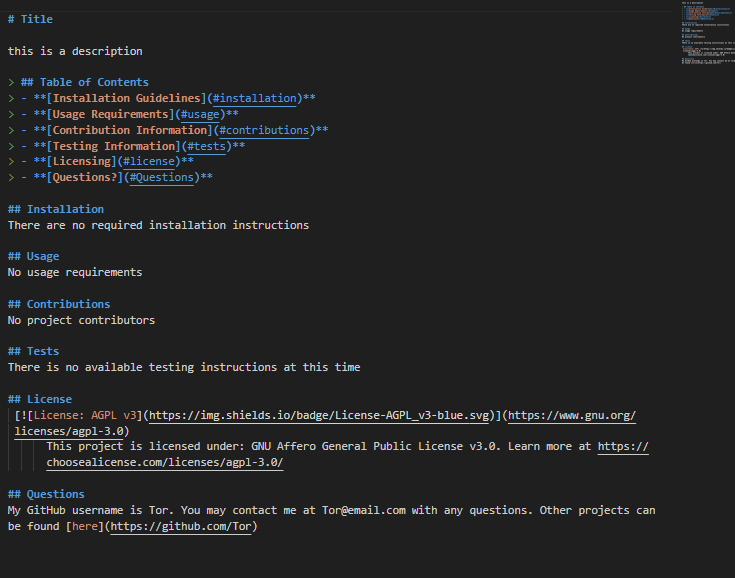

# README Generator Project

This project generates a readme from code run in the terminal. 

To run this project, enter the following into the command line:
```
node index.js
```
Make sure to first initiate npm and install the relevant node modules. This project uses the inquirer package.
```
- npm init
- npm i
```

Respond to the questions present or press enter to take the default value. 
Once complete, the readme file can be found in the ReadMeFolder directory. 



### - GitHub User Info
- Tor Jansson
* [GitHub Link](https://github.com/tjansson-ui/ReadMeGenerator)

See a demo of this project [here](https://drive.google.com/file/d/1wn4E3a_dkB1joxpGGJS1tCVDJJkan1Hz/view?usp=sharing) 